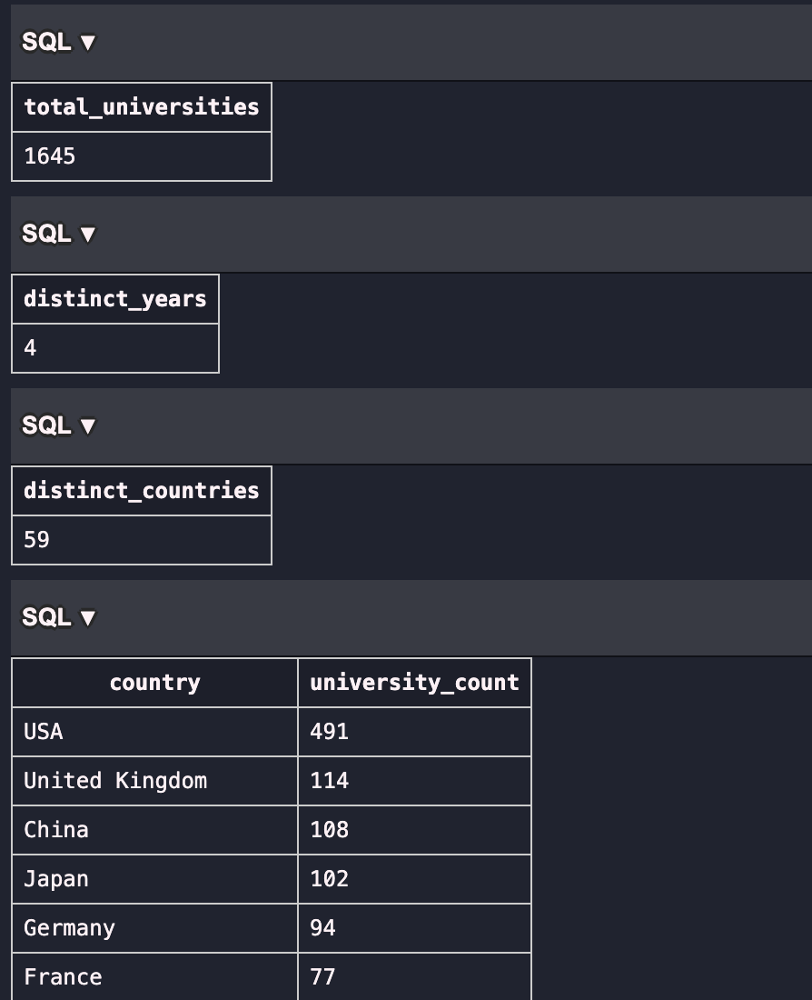
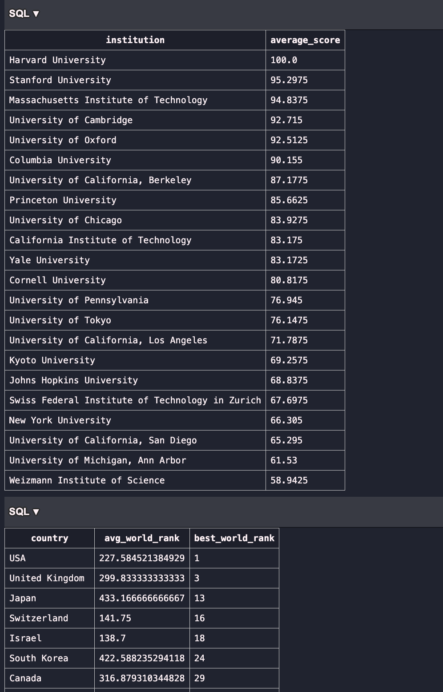
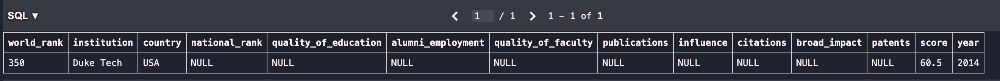
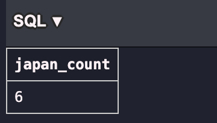
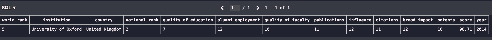

# Week 6 Assignment # 

## Repository Structure ##

The repository is organized as follows:
```
WEEK6_ASSIGNMENT/
├── screenshots/              # Folder containing output images for each SQL operation
│   ├── exercise1.png
│   ├── exercise2.png
│   ├── exercise3.png
│   ├── exercise4.png
│   ├── explore1.png
│   └── explore2.png
├── exercises.sql             # SQL file containing CRUD operation queries
├── exploration.sql           # SQL file used for initial data exploration and analysis
├── script.py                 # Python script that connects to the SQLite database and runs queries using sqlite3 and pandas. All queries contained in script.py exist in exercises.sql and exploration.sql. 
├── university_database.db    # SQLite database file used for analysis
└── README.md                 # Project documentation
```

This project uses **SQLite** to connect and interact with the `university_database.db` database.  
The included **Python script (`script.py`)** uses the `sqlite3` and `pandas` libraries to execute queries, load data into DataFrames, and perform additional analysis programmatically.  
In this assignment, I used both approaches for connecting to the database: the VSCode SQLite extension (for interactive viewing of the tables) and the python script (better for industry practices).


## Setup ##
Approach 1:
1. Install SQLite Extension.
2. Download and Connect to University Database through SQLite.
3. Create .sql files for writing queries.
4. In VSCode, Command + Shift + P --> SQLite: Run Query to see outputs


Approach 2:
1. Run the command `python script.py` to run all queries via python, sqlite3, and pandas and view output in terminal.


## Data Analysis / Exploration ##
The following exploration was done on the university databases data:
1. Number of rows in dataset: 2201
    ```sql
    -- number of rows in data
    SELECT COUNT(*) AS total_universities 
    FROM university_rankings;
    ```

2. Distinct years represented: 4
    ```sql
    -- number of distinct years in data;
    SELECT COUNT(DISTINCT year) AS distinct_years
    FROM university_rankings;
    ```

3. Distinct countries represented: 59
    ```sql
    -- number of countries represented
    SELECT COUNT(DISTINCT country) AS distinct_countries
    FROM university_rankings;
    ```

4. Country representation and counts: The top 5 countries in the data are USA, China, Japan, UK, Germany
    ```sql
    SELECT country, COUNT(*) AS university_count
    FROM university_rankings
    GROUP BY country
    ORDER BY university_count DESC;
    ```

5. Average score for institutions in the top 20 rankings: Harvard has an average score of 100.0, with Stanford having 95.3.
    ```sql
    -- average score for institutions in top 20 rankings
    SELECT institution, AVG(score) AS average_score
    FROM university_rankings
    WHERE institution IN (
        SELECT institution
        FROM university_rankings
        WHERE world_rank <= 20
    )
    GROUP BY institution
    HAVING COUNT(DISTINCT year) > 1
    ORDER BY average_score DESC;
    ```

6. Viewing world rank by country, to see each country's average world rank versus best world ranking, seein that USA and UK schools have both achieved ranks of 1 and 3, which makes sense and the best rank a school in Japan has received is 13. This query uses min aggregation to find the best rankings achieved. 
    ```sql
    -- summarize world rank by country
    SELECT country, AVG(world_rank) AS avg_world_rank, MIN(world_rank) AS best_world_rank
    FROM university_rankings
    GROUP BY country
    ORDER BY best_world_rank ASC;
    ```

Below are the outputs of my exploration as described above: 




## CRUD Operations ##
1. Inserting Duke Tech as an university in 2014 with world rank 350 and score 60.5. All other column values are filled with no values.
    ```sql
    INSERT INTO university_rankings (institution, country, world_rank, score, year)
    VALUES ('Duke Tech', 'USA', 350, 60.5, 2014);
    -- confirm query results
    SELECT * FROM university_rankings
    WHERE institution = 'Duke Tech' AND year = 2014;
    ```
    


2. There are 6 universities from Japan that show up in the global top 200 in 2013.
    ```sql
    SELECT COUNT(*) AS japan_count
    FROM university_rankings
    WHERE country = 'Japan' AND world_rank <= 200 AND year = 2013;
    ```


3. The database is updated to reflect the new calculation for the University of Oxford 2014 score.
    ```sql
    UPDATE university_rankings
    SET score = score + 1.2
    WHERE institution = 'University of Oxford' AND year = 2014;
    -- confirm query results
    SELECT * FROM university_rankings
    WHERE institution = 'University of Oxford' AND year = 2014;
    ```
The below output shows the updated score for this row. 


4. The database is updated to reflect where score < 45 AND year = 2015.
    ```sql
    DELETE FROM university_rankings
    WHERE score < 45 AND year = 2015;
    -- confirm query results that no such rows exist
    SELECT * FROM university_rankings WHERE score < 45 AND year = 2015;
    ```
Note the below output is empty which is expected as those corresponding rows were deleted. 

